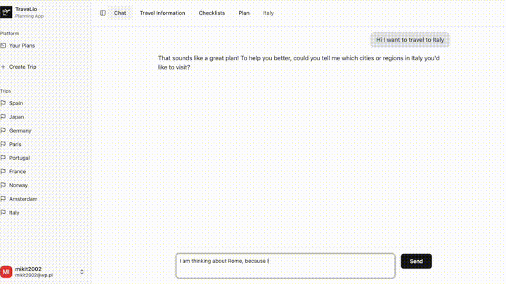
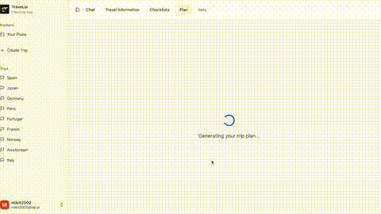
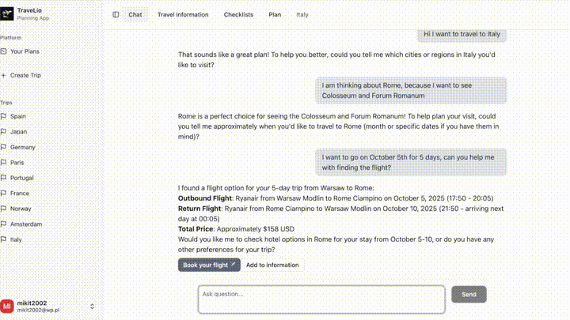
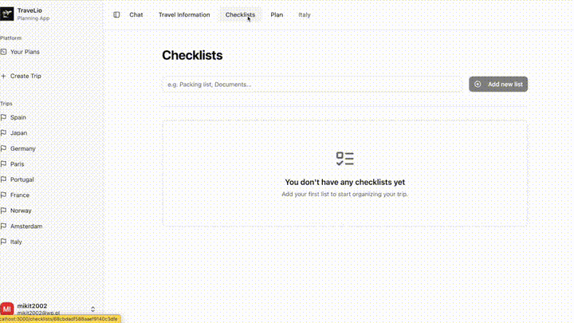
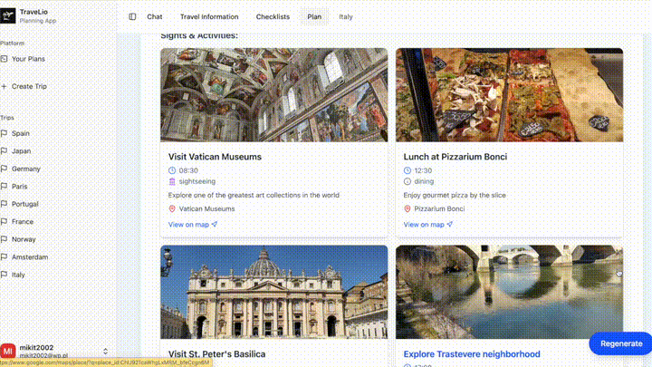

# 🌍 Travel Planner App

The main goal of the application is to simplify the process of planning trips by leveraging the power of large language models (LLMs).

# DEMO

Based on a verbal description of user preferences and a conversation with a large language model, the most important travel details are automatically collected.  

After describing the trip, the app generates a complete travel plan.  

**Travel Planner App** is an intelligent web application powered by **LLM (Large Language Model)** technology that helps users plan their trips in an interactive and automated way.  

---

## ✈️ Description

The application allows users to:
- create multiple **trips**,  
- chat with an AI assistant in the context of each trip,  
- automatically **update travel information**,  
- generate a complete travel plan including attractions for each day  

---

## 🧠 How It Works

1. The user logs into the application.  
2. A new trip can be created manually via the sidebar button or automatically after starting a conversation.  
3. The user chats with the AI assistant — the key information is collected automatically and can be viewed in the **Travel Information** tab.  
4. The user can then go to the **Plan** tab to generate a detailed travel itinerary.  

---

## 🌟 Additional Features

- Users can add personal information to their profile, which is taken into account when generating all travel plans.  
- All previously generated plans are available in the **Your Plans** section.  
- It is possible to **add, delete, or rename** existing trips.  
- Each travel plan can be **regenerated any number of times**.  

---

## 🎥 Main Features in Action

### 💬 Chat

The user talks with the AI chat to collect key information about the trip.  

### ✈️ Flights

External integration with **Kiwi.com** allows users to search for the best flight options directly within the app.  

### 📝 Checklist

Users can create personalized checklists, add new items, and track their progress.  

### 🗺️ Travel Plan

After collecting all necessary details, the app generates a ready-to-use travel plan with daily attractions.  

### 📍 Interactive Map

The generated plan includes an interactive map showing all attractions included in the itinerary.  

---

## ⚙️ Technologies

- **Frontend:** Next.js + React + shadcn/ui  
- **Backend:** FastAPI + LangChain  
- **Database:** MongoDB Atlas  
- **Integrations:** Kiwi.com API (via RapidAPI), Google Maps API, Google Places API  
- **Models:** Deepseek/V3  

---

## 📄 Author

Project developed as an **engineering thesis** in Computer Science.  
Author: *Mikołaj Taudul*  
Year: 2025  

---
